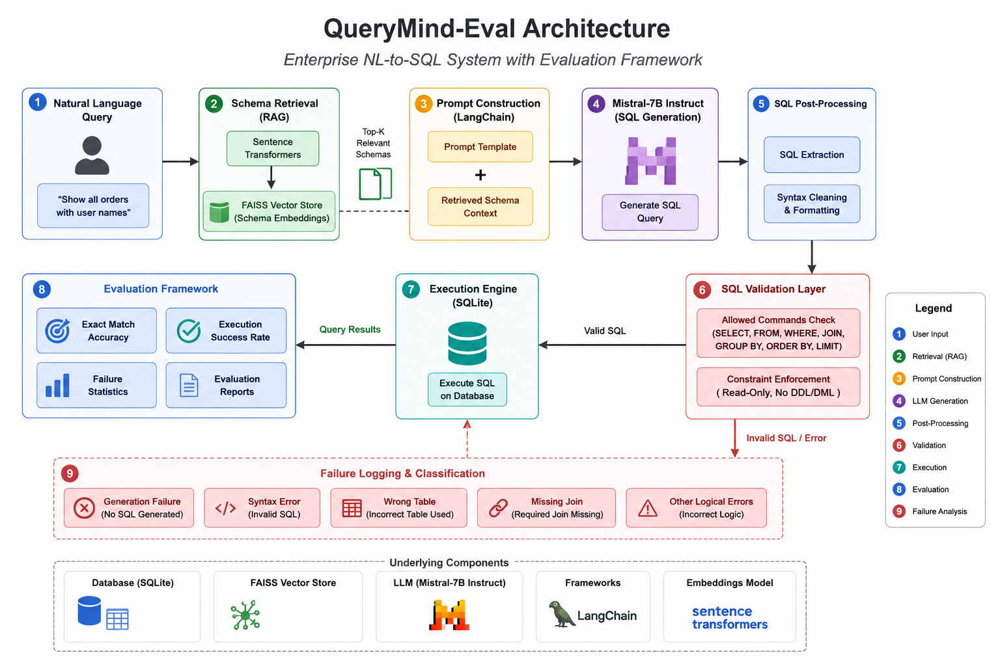

# QueryMind-Eval: Enterprise NL-to-SQL Evaluation Framework

An enterprise-style Natural Language to SQL (NL-to-SQL) system built using **RAG, LangChain, FAISS, and Mistral-7B**, with a strong focus on **evaluation, validation, and failure analysis**.

---

## 🚀 Overview

QueryMind-Eval converts natural language questions into executable SQL queries using Retrieval-Augmented Generation (RAG).

Unlike traditional NL-to-SQL projects, QueryMind-Eval extends the generation pipeline with:

* SQL Validation
* Execution Monitoring
* Failure Logging
* Failure Classification
* Evaluation Reports
* Execution Success Metrics

This makes the project closer to production-grade Enterprise AI systems where reliability and evaluation are as important as generation quality.

---

## 🏗️ Architecture



---

## 🔄 System Pipeline

```text
Natural Language Query
        ↓
Schema Retrieval (FAISS)
        ↓
Prompt Construction (LangChain)
        ↓
Mistral-7B SQL Generation
        ↓
SQL Extraction & Cleaning
        ↓
SQL Validation
        ↓
SQLite Execution Engine
        ↓
Evaluation Framework
        ↓
Failure Analysis & Reporting
```

## ✨ Features

### Natural Language to SQL

* Convert natural language queries into SQL
* Multi-table query support
* JOIN query support
* Schema-aware SQL generation

### Retrieval-Augmented Generation (RAG)

* Sentence Transformer embeddings
* FAISS vector search
* Dynamic schema retrieval

### LangChain Integration

* Prompt templates
* LLM orchestration
* Modular pipeline design

### SQL Validation Layer

* Detect unsafe SQL
* Block destructive operations
* Enforce read-only execution

Restricted commands:

* DROP
* DELETE
* TRUNCATE
* UPDATE
* INSERT

### Query Execution Engine

* SQLite backend
* Runtime SQL execution
* Execution success tracking

### Evaluation Framework

* Exact Match Accuracy
* Execution Success Rate
* Failure Logging
* Failure Classification
* Failure Statistics
* Evaluation Reports

---

## 📊 Evaluation Metrics

### Exact Match Accuracy

Measures whether generated SQL exactly matches the expected SQL query.

### Execution Success Rate

Measures whether generated SQL executes successfully against the database.

### Failure Analysis

Automatically identifies:

* Missing JOIN
* Wrong Table Selection
* SQL Mismatch
* Generation Failure
* Other Logical Errors

---

## 📈 Sample Evaluation Output

```text
Accuracy: 100.00%
Execution Success Rate: 100.00%

===== Evaluation Report =====

Total Failures: 0

Failure Breakdown:
```

---

## 💡 Example Query

### Input

```text
Show all orders with user names
```

### Generated SQL

```sql
SELECT users.name, orders.amount
FROM users
JOIN orders
ON users.id = orders.user_id;
```

---

## 🛠️ Technology Stack

| Component    | Technology                |
| ------------ | ------------------------- |
| Language     | Python                    |
| LLM          | Mistral-7B Instruct       |
| Framework    | LangChain                 |
| Retrieval    | FAISS                     |
| Embeddings   | Sentence Transformers     |
| Database     | SQLite                    |
| ML Framework | Hugging Face Transformers |

---

## 📁 Project Structure

```text
QueryMind-Eval/
│
├── notebooks/
│   └── QueryMind_Eval.ipynb
│
├── images/
│   └── architecture.png
│
├── requirements.txt
│
├── README.md
│
└── LICENSE
```

---

## ⚙️ Installation

```bash
git clone https://github.com/your-username/QueryMind-Eval.git

cd QueryMind-Eval

pip install -r requirements.txt
```

---

## 🔮 Future Improvements

* Self-correcting SQL Agent
* Multi-database support
* Larger benchmark datasets
* Automated regression testing
* Interactive evaluation dashboard
* LLM-as-a-Judge evaluation

---

## 🎯 Motivation

Enterprise AI systems require more than generating outputs.

They must:

* Measure performance
* Track failures
* Enforce constraints
* Analyze regressions
* Provide explainable evaluation

QueryMind-Eval was built to explore these concepts through an end-to-end NL-to-SQL evaluation framework.

---

## 👨‍💻 Author

**Sandeep**

M.Tech in Data Science and AI

Indian Institute of Technology Tirupati
